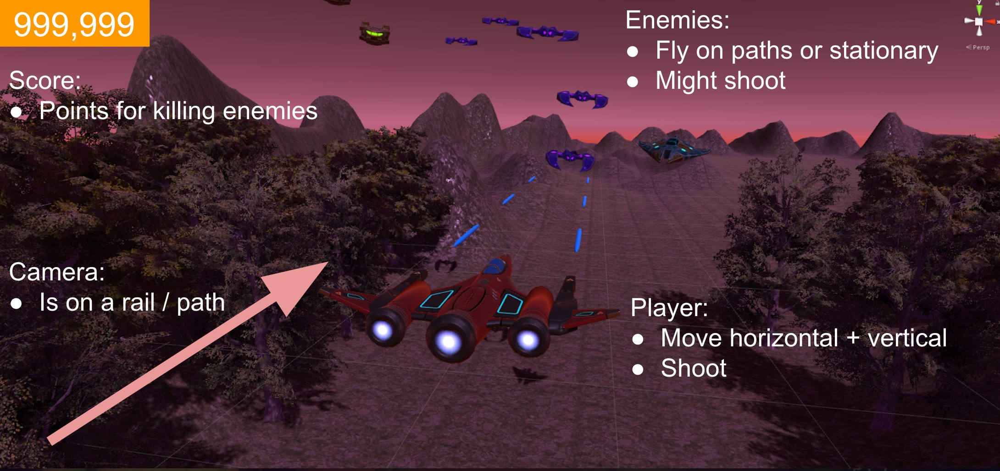
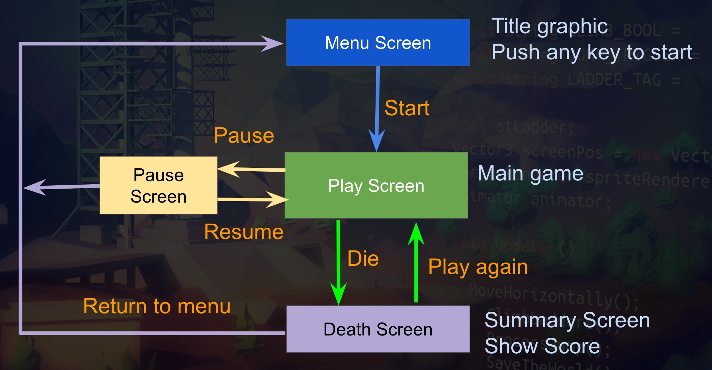
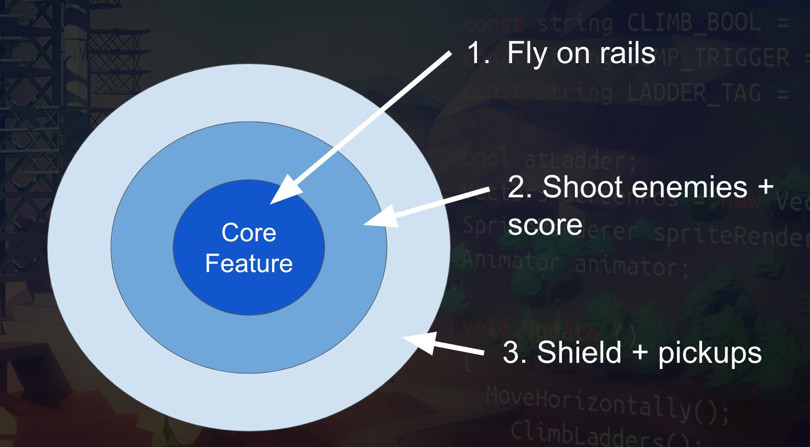

# ArgonAssault
This is a 3D rail shooter inspired by such classics as Star Fox 64 and Panzer Dragoon.

This is the fourth section of the [Complete Unity Developer 2.0 course](https://www.udemy.com/unitycourse2).

## Game Design

* Player Experience: Chaos.
* Core Mechanic: Dodge and shoot.
* Core game loop: Get as far as possible without dying in order to get the highest score possible. Start from beginning when die.

## Game Theme
* Triggerou must save your planet, Argon, from destruction by an invading force.

## Game Flow & Screens

## Features
* Player Movement: Horizontal and vertical movement.
* Shooting: Player and enemies can shoot bullets which do damage to
opponent. Speed, rate of fire and damage should be tunable.
* Enemy Paths: Enemies should travel on paths. Type of enemies, number of
enemies and rate of spawn need to be tunable. Difficulty scaling and
randomisation of paths is needed.
* Score: Points are given for killing enemies.
* Camera Rail: Path through the level that the camera follows.
* Menu system: Start menu, pause screen, death screen.
 
## Stretch Goals
* Player Shield: When damaged, the player’s shield depletes. Can be increased by picking up a shield pickup.
* Pickups: Flying over a shield pickup will increase the player’s shields.
* Momentary invulnerability: After taking damage, the player cannot take
damage again for X time.
 
   
## Onion Design

## Tech Specs
* 1920x1080 16:9 aspect ratio. 
* Build to PC, Mac, Web.
 